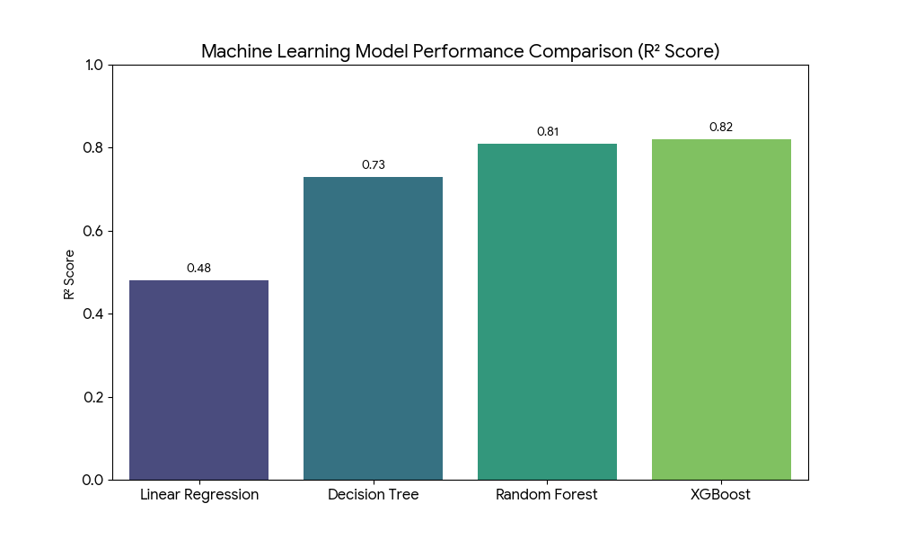
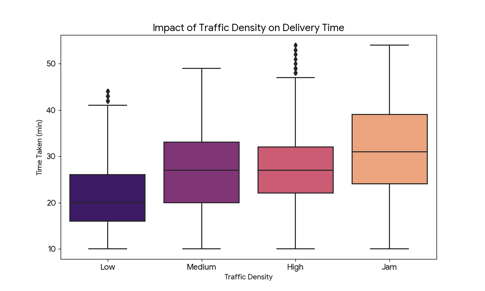
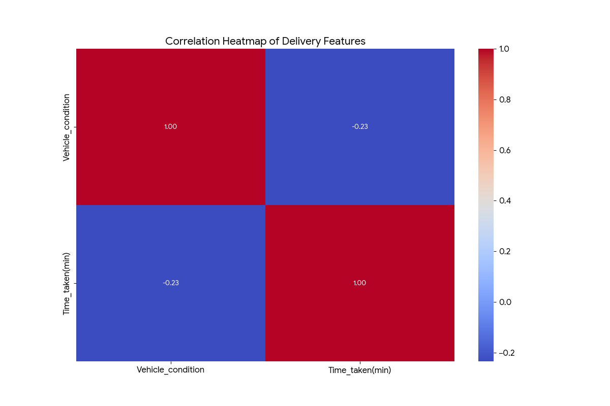

# 🚴‍♂️ Food Delivery Time Prediction: A Big Data Analysis

## 📌 Project Overview
In the on-demand food delivery industry, providing an accurate **Estimated Time of Arrival (ETA)** is vital for customer satisfaction. This project explores a dataset of ~45,000 delivery records to build a high-performance regression model that predicts delivery times based on real-world constraints.

---

## 🛠️ Tech Stack & Tools
* **Language:** Python 3.x
* **Data Libraries:** `Pandas`, `NumPy`
* **Visualization:** `Matplotlib`, `Seaborn`
* **Machine Learning:** `Scikit-Learn`, `XGBoost`
* **Geospatial:** `Geopy` (Haversine formula for distance calculation)

---

## 🚀 Key Features of the Analysis

### 1. Advanced Feature Engineering
* **Geospatial Distance:** Calculated the direct distance between the restaurant and the delivery location using latitude and longitude.
* **Time Analysis:** Extracted order preparation lag and categorized delivery windows (Morning, Afternoon, Evening, Night).
* **Categorical Encoding:** Applied One-Hot and Label Encoding to handle variables like **Weather conditions** and **Traffic density**.
  

### 2. Comparative Modeling
I tested multiple algorithms to find the best fit for this high-variance data:

| Model | R-Square (R²) | Mean Absolute Error (MAE) |
| :--- | :---: | :---: |
| Linear Regression | 0.48 | 6.20 min |
| Decision Tree | 0.73 | 3.80 min |
| Random Forest | 0.81 | 3.21 min |
| **🥇 XGBoost Regressor** | **0.82** | **3.14 min** |

### 3. 📊 Visualizing the Results

#### I. Model Performance
This chart shows that XGBoost had the highest R² score, making it our primary model for predictions.

#### II. Traffic & Environmental Impact
We observed a direct correlation between high traffic density ("Jam") and increased delivery times.

#### III. Feature Relationships
The heatmap below illustrates how different variables like delivery person age and ratings interact with the time taken.

---

## 📊 Key Insights
* **Traffic Impact:** "Jam" density increases delivery time by an average of **12+ minutes**, making it the most significant predictor.
* **Weather Effects:** Stormy and Sandstorm conditions significantly degrade delivery efficiency compared to Sunny conditions.
* **Model Performance:** Ensemble methods (Random Forest and XGBoost) significantly outperformed linear models, proving that delivery variables have non-linear relationships.

---

## 🌍 Global Impact (SDGs)
This project is aligned with the **United Nations Sustainable Development Goals**:
* **SDG 9 (Industry, Innovation, and Infrastructure):** Improving logistics via data.
* **SDG 11 (Sustainable Cities):** Optimizing urban delivery flows to reduce congestion.

---

## 📂 Repository Structure
* `dataset.csv`: The raw dataset containing delivery logs.
* `food_delivery.ipynb`: The complete Jupyter Notebook with EDA and Modeling.
* `Analysis_Report.docx`: The formal academic report detailing the methodology.

---

## 👥 Authors
**Sydney Group 111** 
* **Bindu Vekariya** (c3551040)
* **Yidan Zou** (c3529977)

---
*This project was completed as part of the **INFT6201 Big Data Analytics** course.*
